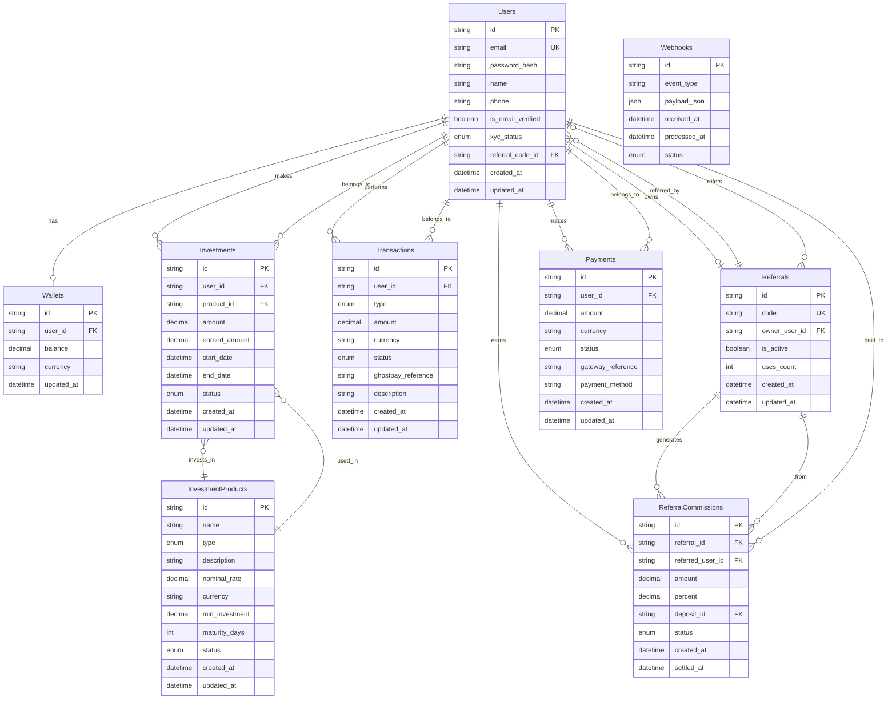

# Diagrama ER - Banco de Dados

## Descrição das Entidades

### Users
- **id**: Identificador único do usuário (UUID)
- **email**: Email único do usuário
- **password_hash**: Senha criptografada com bcrypt
- **name**: Nome completo do usuário
- **phone**: Telefone (opcional)
- **is_email_verified**: Status de verificação do email
- **kyc_status**: Status da verificação KYC (PENDING, VERIFIED, REJECTED, EXPIRED)
- **referral_code_id**: Código de referral usado no cadastro (opcional)

### Wallets
- **id**: Identificador único da carteira
- **user_id**: Referência ao usuário proprietário
- **balance**: Saldo atual da carteira
- **currency**: Moeda da carteira (padrão: BRL)

### InvestmentProducts
- **id**: Identificador único do produto
- **name**: Nome do produto de investimento
- **type**: Tipo do produto (CDB, LCI, LCA, TESOURO_SELIC, TESOURO_IPCA, TESOURO_PREFIXADO)
- **description**: Descrição do produto
- **nominal_rate**: Taxa nominal anual
- **currency**: Moeda do produto
- **min_investment**: Valor mínimo de investimento
- **maturity_days**: Prazo de vencimento em dias
- **status**: Status do produto (ACTIVE, INACTIVE, SUSPENDED)

### Investments
- **id**: Identificador único do investimento
- **user_id**: Referência ao usuário investidor
- **product_id**: Referência ao produto investido
- **amount**: Valor investido
- **earned_amount**: Valor dos rendimentos
- **start_date**: Data de início do investimento
- **end_date**: Data de vencimento
- **status**: Status do investimento (ACTIVE, MATURED, CANCELLED)

### Transactions
- **id**: Identificador único da transação
- **user_id**: Referência ao usuário
- **type**: Tipo da transação (DEPOSIT, WITHDRAWAL, INVESTMENT, REFUND, COMMISSION)
- **amount**: Valor da transação
- **currency**: Moeda da transação
- **status**: Status da transação (PENDING, COMPLETED, FAILED, CANCELLED)
- **ghostpay_reference**: Referência do Ghostpay (opcional)
- **description**: Descrição da transação

### Referrals
- **id**: Identificador único do referral
- **code**: Código único do referral
- **owner_user_id**: Referência ao usuário proprietário do código
- **is_active**: Status ativo do código
- **uses_count**: Número de usos do código

### ReferralCommissions
- **id**: Identificador único da comissão
- **referral_id**: Referência ao código de referral
- **referred_user_id**: Referência ao usuário que recebe a comissão
- **amount**: Valor da comissão
- **percent**: Percentual da comissão
- **deposit_id**: Referência ao depósito que gerou a comissão
- **status**: Status da comissão (PENDING, SETTLED, CANCELLED)
- **settled_at**: Data de liquidação da comissão

### Payments
- **id**: Identificador único do pagamento
- **user_id**: Referência ao usuário
- **amount**: Valor do pagamento
- **currency**: Moeda do pagamento
- **status**: Status do pagamento (PENDING, COMPLETED, FAILED, CANCELLED, REFUNDED)
- **gateway_reference**: Referência do gateway de pagamento
- **payment_method**: Método de pagamento utilizado

### Webhooks
- **id**: Identificador único do webhook
- **event_type**: Tipo do evento recebido
- **payload_json**: Dados do webhook em JSON
- **received_at**: Data de recebimento
- **processed_at**: Data de processamento
- **status**: Status do processamento (PENDING, PROCESSED, FAILED)

## Relacionamentos

1. **Users ↔ Wallets**: Um usuário tem uma carteira (1:1)
2. **Users ↔ Investments**: Um usuário pode ter vários investimentos (1:N)
3. **Users ↔ Transactions**: Um usuário pode ter várias transações (1:N)
4. **Users ↔ Payments**: Um usuário pode ter vários pagamentos (1:N)
5. **Users ↔ Referrals**: Um usuário pode ter vários códigos de referral (1:N)
6. **Users ↔ ReferralCommissions**: Um usuário pode receber várias comissões (1:N)
7. **InvestmentProducts ↔ Investments**: Um produto pode ser usado em vários investimentos (1:N)
8. **Referrals ↔ ReferralCommissions**: Um código pode gerar várias comissões (1:N)
9. **Referrals ↔ Users**: Um código pode referenciar um usuário (1:1)

## Índices Recomendados

- `Users.email` (único)
- `Referrals.code` (único)
- `Transactions.user_id`
- `Investments.user_id`
- `Payments.user_id`
- `ReferralCommissions.referred_user_id`
- `Webhooks.event_type`
- `Webhooks.received_at`
